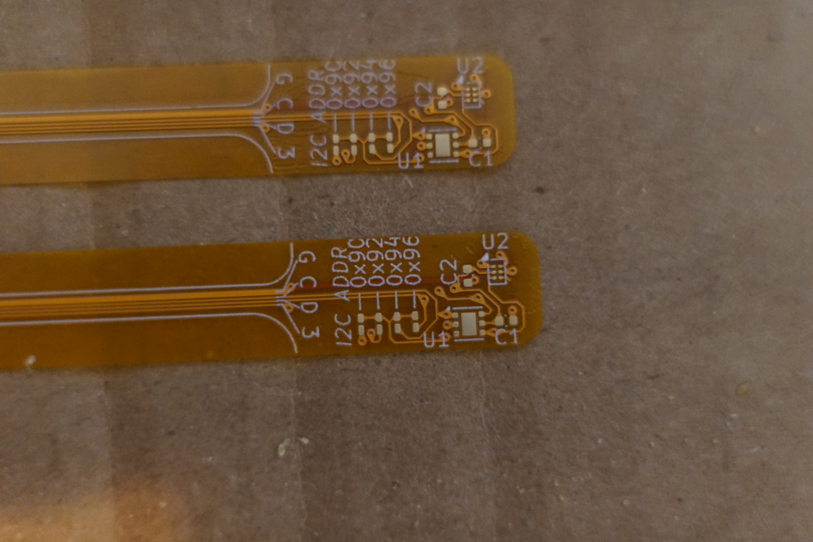

# MultiTherm Ribbon

Individual ribbon cable flex PCB with temperature probe on the end.

Device address is configurable via solderable jumpers.

Supports WSON-6 (TMP117xxDRV) and DSBGA (TMP117xxYBG) packages. Populate one.
